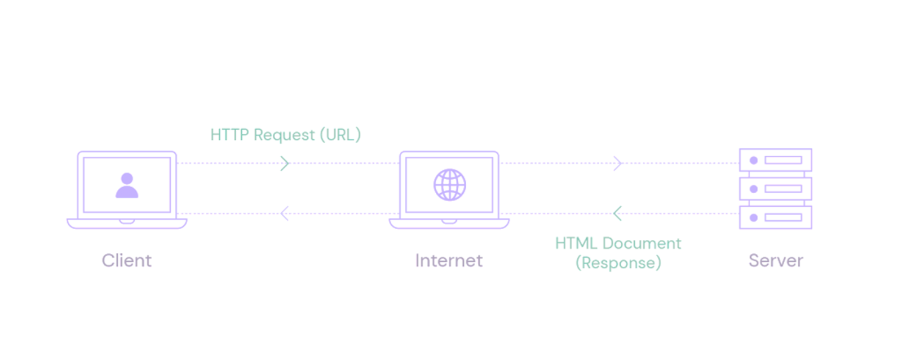

Apache Web Server - Setting Up Virtual Hosts and Configuring Modules

Create the directory for your_domain as follows:
```bash
sudo mkdir /var/www/your_domain
```

Example >> domain1.local
```bash
sudo mkdir /var/www/domain1.local
```

Next, assign ownership of the directory to the user you’re currently signed in as with the $USER environment variable:
```bash
sudo chown -R $USER:$USER /var/www/your_domain
```

Example >> domain1.local
```bash
sudo chown -R $USER:$USER /var/www/domain1.local
```

The permissions of your web root should be correct if you haven’t modified your umask value, which sets default file permissions. To ensure that your permissions are correct and allow the owner to read, write, and execute the files while granting only read and execute permissions to groups and others, you can input the following command:
```bash
sudo chmod -R 755 /var/www/your_domain
```

Example >> domain1.local
```bash
sudo chmod -R 755 /var/www/domain1.local
```

Next, create a sample index.html page using nano or your favorite editor:
```bash
sudo nano /var/www/your_domain/index.html
```

Example >> domain1.local
```bash
sudo vi /var/www/domain1.local/index.html
```

Inside, add the following sample HTML:
```bash
<html>
    <head>
        <title>Welcome to Your_domain!</title>
    </head>
    <body>
        <h1>Success!  The your_domain virtual host is working!</h1>
    </body>
</html>
```

Example >> domain1.local
```bash
<html>
    <head>
        <title>Welcome to domain1.local!</title>
    </head>
    <body>
        <h1>Success!  The domain1.local virtual host is working!</h1>
    </body>
</html>
```

In order for Apache to serve this content, it’s necessary to create a virtual host file with the correct directives. Instead of modifying the default configuration file located at /etc/apache2/sites-available/000-default.conf directly, make a new one at /etc/apache2/sites-available/your_domain.conf:
```bash
sudo nano /etc/apache2/sites-available/your_domain.conf
```

Example >> domain1.local
```bash
sudo vi /etc/apache2/sites-available/domain1.local.conf
```

Add in the following configuration block, which is similar to the default, but updated for your new directory and domain name:
```bash
<VirtualHost *:80>
    ServerAdmin webmaster@localhost
    ServerName your_domain
    ServerAlias www.your_domain
    DocumentRoot /var/www/your_domain
    ErrorLog ${APACHE_LOG_DIR}/error.log
    CustomLog ${APACHE_LOG_DIR}/access.log combined
</VirtualHost>
```

Example >> domain1.local
```bash
<VirtualHost *:80>
    ServerAdmin webmaster@domain1.local
    ServerName domain1.local
    ServerAlias domain1.local
    DocumentRoot /var/www/domain1.local
    ErrorLog ${APACHE_LOG_DIR}/error.log
    CustomLog ${APACHE_LOG_DIR}/access.log combined
</VirtualHost>
```

Notice that we’ve updated the DocumentRoot to our new directory and ServerAdmin to an email that the your_domain site administrator can access. We’ve also added two directives: ServerName, which establishes the base domain that will match this virtual host definition, and ServerAlias, which defines further names that will match as if they were the base name.

Now enable the file with the a2ensite tool:
```bash
sudo a2ensite your_domain.conf
```

Example >> domain1.local
```bash
sudo a2ensite domain1.local.conf
```

Disable the default site defined in 000-default.conf:
```bash
sudo a2dissite 000-default.conf
```

Next, test for configuration errors:
```bash
sudo apache2ctl configtest
```

Restart Apache to implement your changes:
```bash
sudo systemctl restart apache2
```

Apache will now be serving your domain name. You can test this by navigating to http://your_domain, where you will see something like the following:

/var/www/html: The actual web content, which by default only consists of the default Apache page you saw earlier, is served out of the /var/www/html directory. This can be changed by altering Apache configuration files.
```bash
ls -anp /var/www/html
```

/etc/apache2: The Apache configuration directory. All of the Apache configuration files reside here.
```bash
ls -anp /etc/apache2
```

/etc/apache2/apache2.conf: The main Apache configuration file. This can be modified to make changes to the Apache global configuration. This file is responsible for loading many of the other files in the configuration directory.
```bash
cat /etc/apache2/apache2.conf
```

/etc/apache2/ports.conf: This file specifies the ports that Apache will listen on. By default, Apache listens on port 80 and additionally listens on port 443 when a module providing SSL capabilities is enabled.
```bash
cat /etc/apache2/ports.conf
```

/etc/apache2/sites-available/: The directory where per-site virtual hosts can be stored. Apache will not use the configuration files found in this directory unless they are linked to the sites-enabled directory. Typically, all server block configuration is done in this directory and then enabled by linking to the other directory with the a2ensite command.
```bash
ls -anp /etc/apache2/sites-available/
```

/etc/apache2/sites-enabled/: The directory where enabled per-site virtual hosts are stored. Typically, these are created by linking to configuration files found in the sites-available directory with the a2ensite. Apache reads the configuration files and links found in this directory when it starts or reloads to compile a complete configuration.
```bash
ls -anp /etc/apache2/sites-enabled/
```

/etc/apache2/conf-available/, /etc/apache2/conf-enabled/: These directories have the same relationship as the sites-available and sites-enabled directories but are used to store configuration fragments that do not belong in a virtual host. Files in the conf-available directory can be enabled with the a2enconf command and disabled with the a2disconf command.

/etc/apache2/mods-available/, /etc/apache2/mods-enabled/: These directories contain the available and enabled modules, respectively. Files ending in .load contain fragments to load specific modules, while files ending in .conf contain the configuration for those modules. Modules can be enabled and disabled using the a2enmod and a2dismod commands.

/var/log/apache2/access.log: By default, every request to your web server is recorded in this log file unless Apache is configured to do otherwise.
```bash
tail /var/log/apache2/access.log
```

/var/log/apache2/error.log: By default, all errors are recorded in this file. The LogLevel directive in the Apache configuration specifies how much detail the error logs will contain.
```bash
tail /var/log/apache2/error.log
```

To list all installed Apache modules on Ubuntu and search for additional modules, you can use the following commands.
To list the currently loaded Apache modules, you can use the `apachectl` command with the `-M` option:
```bash
apachectl -M
```

Or, you can use the following command with `apache2ctl`:
```bash
apache2ctl -M
```
This will display a list of loaded modules.

To search for available Apache modules that you can install, you can use the `apt search` command. For example:
```bash
apt search libapache2-mod
```
This will display a list of available Apache modules. The `libapache2-mod` prefix is commonly used for Apache modules in the package manager.

To install a specific Apache module, you can use the `apt-get install` command.
```bash
sudo apt-get install libapache2-mod-mapcache -y
sudo apt-get install libapache2-mod-php -y
sudo apt-get install libapache2-mod-php7.4 -y
```

After installing a new module, you need to enable it using the `a2enmod` command. For example:
```bash
sudo a2enmod mapcache
```

Enable rewrites/redirects using the mod_rewrite module
This module is used for rewrites (redirects), as the name suggests. You’ll need it if you use WordPress or any other CMS for that matter. To install it, just run:
```bash
sudo a2enmod rewrite
```

Secure your Apache with the ModSecurity module
ModSecurity is a module used for security, again, as the name suggests. It basically acts as a firewall, and it monitors your traffic. To install it, run the following command:
```bash
sudo apt-get install libapache2-mod-security2 -y
```

If the above command doesn't work, you can try searching for the available ModSecurity package:
```bash
sudo apt search libapache2-mod-security
```
This will show you a list of available packages related to ModSecurity. Look for the appropriate package and install it using `apt-get`.

After installing the ModSecurity module, you may also need to enable it. On newer versions of Ubuntu and Apache, you can use `a2enmod`:
```bash
sudo a2enmod security2
```

After enabling the module, you may need to restart Apache for the changes to take effect:
```bash
sudo systemctl restart apache2
```
Please note that the specific module names and commands may vary depending on the version of Apache and the available packages in your Ubuntu release. Always check the documentation or package manager for the most accurate information.

To list the enabled modules on Apache in Ubuntu, you can use the `a2query` command. Specifically, the `-m` option can be used to list the enabled modules. Open a terminal and run the following command:
```bash
sudo a2query -m
```
This will display a list of currently enabled Apache modules. The output will show the names of the enabled modules.

Block DDoS attacks using the mod_evasive module
You can use the mod_evasive module to block and prevent DDoS attacks on your server, though it’s debatable how useful it is in preventing attacks. To install it, use the following command:
```bash
sudo apt-get install libapache2-mod-evasive -y
```
By default, mod_evasive is disabled, to enable it, edit the following file:
```bash
sudo vi /etc/apache2/mods-enabled/evasive.conf
```
And uncomment all the lines (remove #) and configure it per your requirements. You can leave everything as-is if you don’t know what to edit.
And create a log file:
```bash
sudo mkdir /var/log/mod_evasive 
sudo chown -R www-data:www-data /var/log/mod_evasive
sudo systemctl restart apache2
```

Example for domain1.local - How to Test and Verify?! >>
Add domain1.local >> /etc/hosts
```bash
sudo vi /etc/hosts
```
To verify the response of a website using `curl` on Ubuntu, you can use the following command:
```bash
curl -I http://domain1.local
```
This command sends a HEAD request to the specified URL (`http://domain1.local` in this case) and displays the headers of the HTTP response. The `-I` option tells `curl` to show only the headers.
If you want to see the complete HTTP response (including headers and the response body), you can use:
```bash
curl http://domain1.local
```
Replace `http://domain1.local` with the actual URL you want to test. Make sure that the specified domain is accessible from your machine and that your machine can resolve the domain to the correct IP address.
If you encounter SSL/TLS-related issues or if the website uses HTTPS, you might need to use the `-k` option with `curl` to ignore SSL certificate verification (not recommended for production use):
```bash
curl -kI https://domain1.local
```
Remember to replace `https://domain1.local` with the actual HTTPS URL you want to test.
These `curl` commands can help you inspect the HTTP headers and content returned by the web server for the specified URL.

Important Note: Hostfile >> Windows >> Location: C:\Windows\System32\drivers\etc >> Add domain1.local with ip address in this file (example) >> Using notepad and run as admin

Important Note: Hostfile >> Linux >> Location /etc/hosts >> Add domain1.local with ip address in this file (example)

```bash
sudo apt install net-tools -y
```

```bash
netstat -tupln
```

