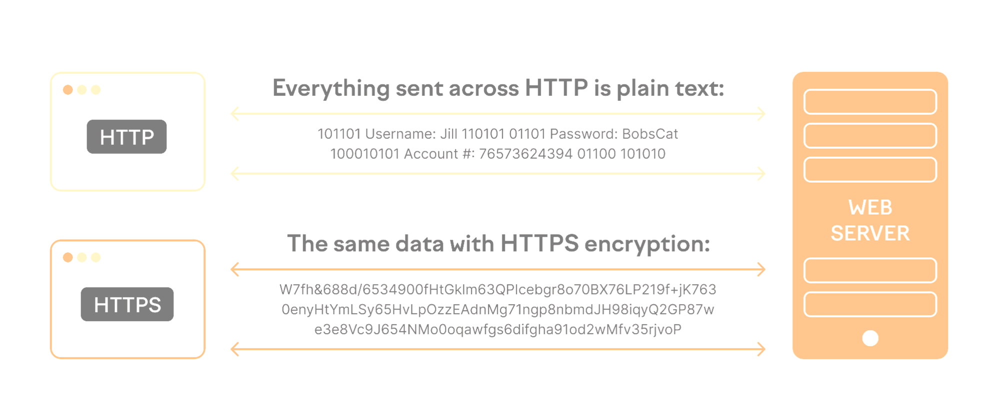

How to Configure Apache SSL - HTTPS Web Server

Example for domain1.local >> 

Generate Apache SSL certificate files
To obtain the SSL certificate files, a “Certificate Signing Request” (CSR) is executed. The CSR process associates the domain name with identifying characteristics of the organization and a cryptographic key. Depending on the certificate provider, the CSR is executed either via a web interface or from the command line. We’ll show an example of a certificate signing request via OpenSSL:
```bash
sudo openssl req -x509 -nodes -days 365 -newkey rsa:2048 -keyout domain1.key -out domain1.crt
```

When the command is executed, information is requested and a handful of files are created. Here’s an overview of the files created when the Certificate Signing Request (CSR) is executed, including file extensions:
Private key >> .key >> Used to generate CSR and later secure and verify connections using the certificate.
CSR file >> .csr >> Required to order the SSL certificate.
Intermediate SSL Certificate >> .crt >> Certificate that enables a certificate authority to issue additional certificates.

To set up Apache SSL, the certificate files are placed on the server. Usually, there are two to three files:
- Private key
- Primary SSL certificate
- Intermediate SSL certificate, if applicable
Put these files in their own folder and make sure they are readable by the root user only. From the command line, use the following steps:
Create folder for certificate files:

Example for domain1.local
```bash
sudo mkdir -p /root/cert/
```

Copy certificate files to folder:
```bash
sudo cp domain1.crt /root/cert/
sudo cp domain1.key /root/cert/
```

```bash
sudo ls -anp /root/cert
```

Customize users and permissions to make folders and files readable only by root:
```bash
sudo chown -R root:root /root/cert/
sudo chmod -R 400 /root/cert/
sudo chmod 500 /root/cert/
```

```bash
cat /etc/apache2/sites-available/domain1.local.conf
```

Now duplicate the HTTP VHost block, adjust the port to 443, and add the Apache SSL-specific settings:
```bash
sudo vi /etc/apache2/sites-available/domain1.local.ssl.conf
```

```bash
<VirtualHost *:443>
    ServerAdmin webmaster@domain1.local
    ServerName domain1.local
    SSLEngine on
    SSLCertificateFile /root/cert/domain1.crt
    SSLCertificateKeyFile /root/cert/domain1.key
    ServerAlias domain1.local
    DocumentRoot /var/www/domain1.local
    ErrorLog ${APACHE_LOG_DIR}/error.log
    CustomLog ${APACHE_LOG_DIR}/access.log combined
</VirtualHost>
```

After this, we need to enable the SSL version of your site. We can run this command to enable the site:
```bash
sudo a2ensite yourdomain.com-ssl.conf
```

```bash
sudo a2ensite domain1.local.ssl.conf
```

```bash
sudo a2enmod ssl
```

Open your Apache configuration file for editing. The main configuration file is typically located at `/etc/apache2/apache2.conf`. You can use a text editor, such as `nano` or `vim`:
```bash
sudo vi /etc/apache2/apache2.conf
```

Add the following line at the end of the file to set the global `ServerName`:
```bash
ServerName localhost
```
Replace "localhost" with the actual FQDN or domain name of your server if you have one. If you don't have a specific domain, setting it to "localhost" is a common practice for development environments.

```bash
tail /etc/apache2/apache2.conf
```

Test Apache SSL functionality 
```bash
sudo apachectl configtest
```
If this command does not work, try the alternative command 'apache2ctl':
```bash
sudo apache2ctl configtest
```
Or check your apache2 configuration by running this command:
```bash
sudo apache2ctl -t
```

If the test was successful, restart the Apache server:
```bash
sudo apachectl restart
```

```bash
sudo systemctl restart apache2
```

Allow Incoming HTTPS Traffic:
Allow incoming traffic on port 443 (HTTPS):
```bash
sudo ufw allow 443
```

```bash
sudo ufw status
sudo ufw app list
```

You can also run the command below to check if the SSL version of your website is enabled or not.
```bash
sudo apachectl -S
```

After the Apache server restarts with customized configuration, test the SSL connection. To do this, open the site in at least two different browsers.

