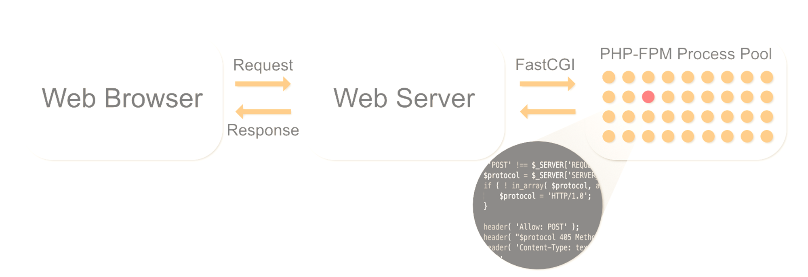

What is PHP and PHP-FPM and How to Install Apache with PHP-FPM

PHP (Hypertext Preprocessor) is a widely-used open-source server-side scripting language. It is especially suited for web development and can be embedded into HTML. PHP is commonly used to create dynamic web pages, process forms, manage databases, and perform other server-side tasks.

PHP-FPM stands for "PHP FastCGI Process Manager." It is a separate and highly efficient process manager for PHP. FastCGI (Fast Common Gateway Interface) is a protocol that enables a web server to communicate with external applications, such as PHP, to handle dynamic content generation. PHP-FPM works as a FastCGI server for PHP, managing processes and handling requests from a web server.

Here are some key points about PHP-FPM:

1. **Process Management:** PHP-FPM manages pools of PHP worker processes. Each pool can have its configuration settings, allowing for fine-grained control over how PHP processes are handled.

2. **Performance:** PHP-FPM is designed to be highly efficient and scalable. It can handle a large number of simultaneous connections and requests, making it suitable for high-traffic websites.

3. **Isolation:** PHP-FPM provides process isolation, meaning that each PHP pool runs independently of others. This helps prevent issues in one pool from affecting others, enhancing the overall stability of a web server.

4. **Resource Management:** PHP-FPM allows for the management of resources, such as setting limits on the number of processes, controlling memory usage, and adjusting various performance-related settings.

5. **Integration with Web Servers:** PHP-FPM can be integrated with various web servers, including Nginx and Apache, allowing these servers to offload PHP processing to the PHP-FPM process manager.

Overall, PHP-FPM is a crucial component for optimizing the performance and scalability of PHP applications in a web server environment. It provides a robust and efficient way to manage PHP processes, ensuring better handling of dynamic content and improved overall performance.

Apache and PHP-FPM are both widely used in web development to serve dynamic content. While Apache is the most popular web server used today, PHP-FPM is a FastCGI process manager that provides a faster and more efficient way to process PHP requests. Combining the two can significantly improve the performance of a website.

Before installing any new software, you should update your system to ensure that all packages are up to date. You can do this by running the following command in the terminal:
```bash
sudo apt update && sudo apt upgrade -y
```

Install PHP-FPM
The default repositories may not contain the latest PHP version packages. So we always prefer to use ondrej/php PPA for installing PHP that contains most of the versions.
To configure PPA, run the following commands:
```bash
sudo add-apt-repository ppa:ondrej/php
```
Then install the PHP along with PHP-FPM, by running the following command in the terminal:
```bash
sudo apt install php8.2 php8.2-fpm -y
```
Note: Replace “8.2” with the required PHP versions (Like: 8.1, 7.4, 7.3, etc). 

Once the installation is complete, you can start the PHP-FPM service by running the following command:
```bash
sudo systemctl start php8.2-fpm
```

You can also enable PHP-FPM to start at boot time by running the following command:
```bash
sudo systemctl enable php8.2-fpm
```

Configure Apache to use PHP-FPM
To configure Apache to use PHP-FPM, you need to enable the “proxy_fcgi” and “proxy” modules. You can do this by running the following command:
```bash
sudo a2enmod proxy_fcgi proxy
```

Example >> domain2.local
Create a new configuration file for your virtual host using the following command:
```bash
sudo vi /etc/apache2/sites-available/domain2.local.conf
```
Note: Replace “domain2.local” with your domain name. 

Inside the new configuration file, add the following configuration with PHP-FPM:
```bash
<VirtualHost *:80>
    ServerName domain2.local
    ServerAlias domain2.local
    DocumentRoot /var/www/domain2.local
    <Directory /var/www/domain2.local>
        Options -Indexes +FollowSymLinks +MultiViews
        AllowOverride All
        Require all granted
    </Directory>
    <FilesMatch \.php$>
        SetHandler "proxy:unix:/run/php/php8.2-fpm.sock|fcgi://localhost/"
    </FilesMatch>
    ErrorLog ${APACHE_LOG_DIR}/error.log
    CustomLog ${APACHE_LOG_DIR}/access.log combined
</VirtualHost>
```

Enable the new virtual host by running the following command:
```bash
sudo a2ensite domain2.local.conf
```

Reload the Apache web server to apply the changes:
```bash
sudo systemctl reload apache2 
```

```bash
sudo mkdir -p /var/www/domain2.local/
```

To test the Apache with PHP-FPM configuration, create a new PHP file in the document root directory of your website:
```bash
sudo vi /var/www/domain2.local/index.php
```

Add the following lines to the file:
```bash
<?php phpinfo(); ?>
```

Then, open your web browser and navigate to “http://domain2.local/”. If everything is configured correctly, you should see the PHP information page.

```bash
php -v
```

