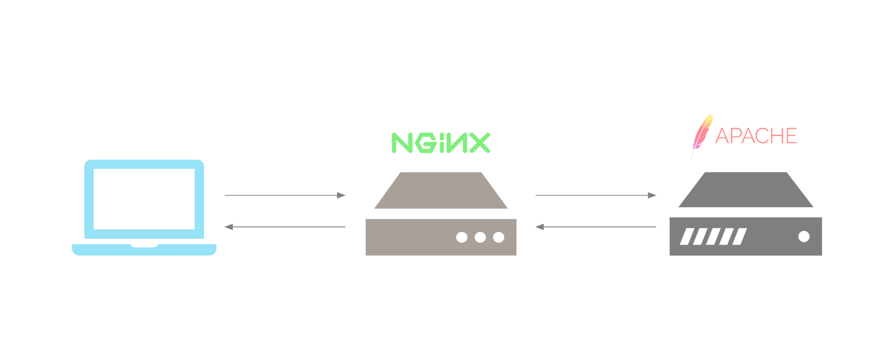

Apache Web Server - Install Nginx as a Reverse Proxy for Apache + SSL

Nginx is a powerful and widely-used open-source web server and reverse proxy server software. Originally developed to address the challenge of handling 10,000 simultaneous connections problem. Nginx has become popular for its performance, scalability, and versatility.

Here are two primary roles of Nginx:

1. **Web Server:**
   - Nginx can serve static content like HTML, CSS, and images directly to clients.
   - It is known for its efficiency in handling a large number of simultaneous connections and requests.

2. **Reverse Proxy:**
   - Nginx can act as a reverse proxy, sitting between client devices and backend servers.
   - In a reverse proxy setup, Nginx receives client requests and forwards them to the appropriate backend server. It then takes the response from the backend server and sends it back to the client.
   - This architecture has several advantages, including load balancing, improved security, and easier management of backend server resources.

**Nginx Reverse Proxy:**
A reverse proxy is a server that sits between client devices and backend servers, forwarding client requests to the servers and returning the servers' responses to clients. Here are some common use cases for Nginx as a reverse proxy:

1. **Load Balancing:**
   - Nginx can distribute incoming client requests among multiple backend servers to balance the load. This helps ensure that no single server becomes overwhelmed, improving overall system performance and reliability.

2. **SSL Termination:**
   - Nginx can handle SSL/TLS encryption and decryption, offloading this process from backend servers. This is known as SSL termination, and it helps reduce the computational load on backend servers.

3. **Security:**
   - Acting as a reverse proxy, Nginx can provide an additional layer of security by hiding the internal structure of your network and servers. It can also filter and block malicious requests.

4. **Caching:**
   - Nginx can cache static content or even dynamic content for a certain period. This helps reduce the load on backend servers and improves response times for frequently requested content.

5. **HTTP Acceleration:**
   - Nginx can be used to accelerate HTTP requests by serving static content directly and forwarding dynamic content requests to backend servers.

Nginx is a versatile web server and reverse proxy that plays a crucial role in improving the performance, scalability, and security of web applications. Its flexibility makes it suitable for a wide range of scenarios, from serving static content to complex load balancing setups.

Using Nginx as a reverse proxy alongside Apache offers a range of benefits that significantly enhance website performance, security, and compatibility. Nginx's efficient resource utilization, with each process thread capable of handling numerous concurrent user connections, reduces context switching, CPU consumption, and RAM usage compared to Apache, resulting in improved server speeds and scalability. 

The enhanced security features of Nginx, particularly its ability to safeguard against DDoS and DoS attacks, make it a valuable shield when placed in front of an Apache web server. 

Moreover, the combination of Nginx's prowess in handling static content and Apache's excellence in serving dynamic content results in optimal overall performance. 

Nginx can also function as a load balancer, evenly distributing incoming traffic across multiple Apache servers to prevent overload. This compatibility ensures that web applications designed for Apache can still be utilized, allowing users to benefit from the strengths of both servers and creating a high-performing and secure environment for websites or applications.

First >> Changing Apache Default Port Number from 80 and 443 to X and Y

To check which port number Apache is running on using `netstat` or `ps aux` commands, you can follow these steps:
Run the following command to list all the listening ports and their associated processes:
```bash
sudo netstat -tuln
```

Run the following command >> to check if apache running or not!
```bash
ps aux | grep apache
```

Change the port number from 80 and 443 >> to 8080 and 4443 (example) >> apache2 >> ports.conf
```bash
cat /etc/apache2/ports.conf
```
```bash
sudo vi /etc/apache2/ports.conf
```
Change the port numbers from 80 and 443 to another number and save the config files

To list all apache sites available
```bash
ls -anp /etc/apache2/sites-available/
```

Example for >> domain1.local and domain2.local and apache default config files
Change the port number from 80 and 443 >> to 8080 and 4443 (example)
```bash
sudo vi /etc/apache2/sites-available/000-default.conf
```
```bash
sudo vi /etc/apache2/sites-available/default-ssl.conf
```
```bash
sudo vi /etc/apache2/sites-available/domain1.local.conf
```
```bash
sudo vi /etc/apache2/sites-available/domain1.local.ssl.conf
```
```bash
sudo vi /etc/apache2/sites-available/domain2.local.conf
```

```bash
sudo apachectl configtest
```

```bash
sudo service apache2 restart
```

```bash
sudo apachectl -S
```

```bash
sudo netstat -tuln
```

Setting Up an Nginx Reverse Proxy with Apache
The first step in setting up an Nginx reverse proxy with Apache is to install Nginx on your server. Most Linux distributions have Nginx available in their package repositories, making installation simple. For example, on Ubuntu, you can install Nginx using the following command:
```bash
sudo apt-get install nginx -y
```

Once Nginx is installed, you’ll need to disable the default virtual host configuration. This can be done by removing the default symbolic link in the sites-enabled directory:
```bash
sudo rm /etc/nginx/sites-enabled/default
```

Creating the Nginx Reverse Proxy Configuration File
Next, you’ll need to create a new Nginx reverse proxy configuration file. This file will contain the necessary directives to forward incoming traffic to your Apache server. Create a new file called reverse-proxy.conf in the /etc/nginx/sites-available directory:
```bash
sudo vi /etc/nginx/sites-available/reverse-proxy.conf
```

In this file, you’ll define the server block for your Nginx reverse proxy. The following example demonstrates a basic configuration that forwards incoming traffic on port 80 to an Apache server listening on port 8080:
Example for domain1.local and domain2.local >>
```bash
server {
    listen 80;
    server_name domain1.local;

    location / {
        proxy_pass http://domain1.local:8080;
        proxy_set_header Host $host;
        proxy_set_header X-Real-IP $remote_addr;
        proxy_set_header X-Forwarded-For $proxy_add_x_forwarded_for;
    }
}

server {
    listen 80;
    server_name domain2.local;

    location / {
        proxy_pass http://domain2.local:8080;
        proxy_set_header Host $host;
        proxy_set_header X-Real-IP $remote_addr;
        proxy_set_header X-Forwarded-For $proxy_add_x_forwarded_for;
    }
}

```

Configuring the proxy_pass Directive
The proxy_pass directive is the core of your Nginx reverse proxy configuration. It specifies the destination of the proxied requests, which in this case is your Apache server. In the example above, the Apache server is listening on localhost:8080. Adjust this value as needed to match your own Apache server’s address and port number.
Once you’ve finished editing the reverse-proxy.conf file, save and close it. Then, create a symbolic link to the sites-enabled directory to enable the configuration:
```bash
sudo ln -s /etc/nginx/sites-available/reverse-proxy.conf /etc/nginx/sites-enabled/
```

```bash
ls -anp /etc/nginx/sites-enabled/
```

```bash
sudo cat /etc/hosts
```
Add domain1.local and domain2.local (example) in hosts file >> ip address 127.0.0.1
```bash
sudo vi /etc/hosts
```
```bash
127.0.0.1  domain1.local
127.0.0.1  domain2.local
```

Finally, restart Nginx to apply the changes:
```bash
sudo service nginx restart
```

```bash
sudo netstat -tuln
```

Testing Your Nginx Reverse Proxy Setup
To test your Nginx reverse proxy setup, try accessing your domain in a web browser. If everything is configured correctly, you should see the content served by your Apache server. To confirm that Nginx is acting as a reverse proxy, you can check the Nginx access logs for entries containing the X-Forwarded-For header:
```bash
sudo tail /var/log/nginx/access.log
```

Nginx Reverse Proxy Configuration + Cache
```bash
sudo vi /etc/nginx/sites-available/reverse-proxy.conf
```

Nginx cache configuration >> Example for domain1.local and domain2.local >>
```bash
proxy_cache_path        /var/www/cache levels=1:2 keys_zone=my-cache:10m max_size=10g inactive=600m;
proxy_temp_path         /var/www/cache/tmp;
proxy_connect_timeout   600;
proxy_send_timeout      600;
proxy_read_timeout      600;
send_timeout            600;
proxy_cache_key         $scheme$host$request_uri;
proxy_buffers           256 16k;
proxy_buffer_size       32k;
proxy_set_header        Proxy "";
proxy_set_header        X-Forwarded-For $proxy_add_x_forwarded_for;
server {
        listen 80;
        server_name domain1.local;
        set $skip_cache 0;
        set $skip_reason "";
        location / {
                proxy_pass http://domain1.local:8080;
                proxy_set_header Host $host;
                proxy_set_header X-Real-IP $remote_addr;
                proxy_set_header X-Forwarded-For $proxy_add_x_forwarded_for;
                proxy_cache my-cache;
                proxy_cache_revalidate on;
                proxy_ignore_headers Expires Cache-Control;
                proxy_cache_use_stale error timeout invalid_header updating http_500 http_502 http_503 http_504;
                proxy_cache_bypass $skip_cache;
                proxy_no_cache $skip_cache;
                proxy_cache_valid 200 301 302 5m;
                proxy_cache_valid 404 1m;
        }
}
server {
        listen 80;
        server_name domain2.local;
        set $skip_cache 0;
        set $skip_reason "";
        location / {
                proxy_pass http://domain2.local:8080;
                proxy_set_header Host $host;
                proxy_set_header X-Real-IP $remote_addr;
                proxy_set_header X-Forwarded-For $proxy_add_x_forwarded_for;
                proxy_cache my-cache;
                proxy_cache_revalidate on;
                proxy_ignore_headers Expires Cache-Control;
                proxy_cache_use_stale error timeout invalid_header updating http_500 http_502 http_503 http_504;
                proxy_cache_bypass $skip_cache;
                proxy_no_cache $skip_cache;
                proxy_cache_valid 200 301 302 5m;
                proxy_cache_valid 404 1m;
        }
}
```

```bash
sudo service nginx restart
```

```bash
sudo apt-get install curl -y
```

```bash
curl -I http://domain1.local
```

```bash
curl -I http://domain2.local
```

```bash
sudo ls -anp /var/www/cache/
```

Configuring Apache mod_rpaf
When using Nginx as a reverse proxy, it’s important to configure Apache to recognize the X-Forwarded-For header. This can be done using the mod_rpaf module, which rewrites environment variables in Apache to reflect the original client IP address. Doing this allows the scripts run under apache to know the real IP address of the browsers to your website, critical for security, logging, and traffic analysis. To install mod_rpaf on Ubuntu, you can use the following command:
```bash
sudo apt-get install libapache2-mod-rpaf
```
```bash
cat /etc/apache2/mods-available/rpaf.conf
```
```bash
sudo service apache2 restart
```

Reverse Proxy with Nginx + SSL Configuration
Configure Nginx to use SSL

```bash
sudo ls -anp /root/cert
```

Сreate a new file named self-signed.conf
```bash
sudo vi /etc/nginx/snippets/self_signed_domain1.conf
```

In self-signed.conf we want to add some variables that will hold the location of our certificate and key files
```bash
ssl_certificate /root/cert/domain1.crt;
ssl_certificate_key /root/cert/domain1.key;
```

Now we will create a snippet file to define SSL settings. Start by creating a file like this
```bash
sudo vi /etc/nginx/snippets/ssl-params.conf
```

In this file, we need to include some SSL settings as below
```bash
ssl_protocols TLSv1.3;
ssl_prefer_server_ciphers on;
ssl_ciphers EECDH+AESGCM:EDH+AESGCM;
ssl_ecdh_curve secp384r1;
ssl_session_timeout  10m;
ssl_session_cache shared:SSL:10m;
ssl_session_tickets off;
ssl_stapling on;
ssl_stapling_verify on;
resolver 8.8.8.8 8.8.4.4 valid=300s;
resolver_timeout 5s;
add_header X-Frame-Options DENY;
add_header X-Content-Type-Options nosniff;
add_header X-XSS-Protection "1; mode=block";
```

In this step, we need to modify the Nginx configuration to use SSL. Open up your Nginx configuration file which is usually in a location like /etc/nginx/sites-available/
```bash
sudo vi /etc/nginx/sites-available/reverse-proxy.conf
```

SSL Example for domain1.local
Add the lines below:
```bash
server {
        listen 443 ssl;
        listen [::]:443 ssl;
        include snippets/self_signed_domain1.conf;
        include snippets/ssl-params.conf;
        server_name domain1.local;
        set $skip_cache 0;
        set $skip_reason "";
        location / {
                proxy_pass http://domain1.local:8080;
                proxy_set_header Host $host;
                proxy_set_header X-Real-IP $remote_addr;
                proxy_set_header X-Forwarded-For $proxy_add_x_forwarded_for;
                proxy_cache my-cache;
                proxy_cache_revalidate on;
                proxy_ignore_headers Expires Cache-Control;
                proxy_cache_use_stale error timeout invalid_header updating http_500 http_502 http_503 http_504;
                proxy_cache_bypass $skip_cache;
                proxy_no_cache $skip_cache;
                proxy_cache_valid 200 301 302 5m;
                proxy_cache_valid 404 1m;
        }
}
```

```bash
sudo ufw app list
```

```bash
sudo ufw allow 'Nginx Full'
```

```bash
sudo ufw status
```

```bash
sudo nginx -t
```

```bash
sudo service nginx restart
```

Verify >> https://domain1.local >> just as an example

```bash
sudo find /var/www/cache/ -type f -ls
```

